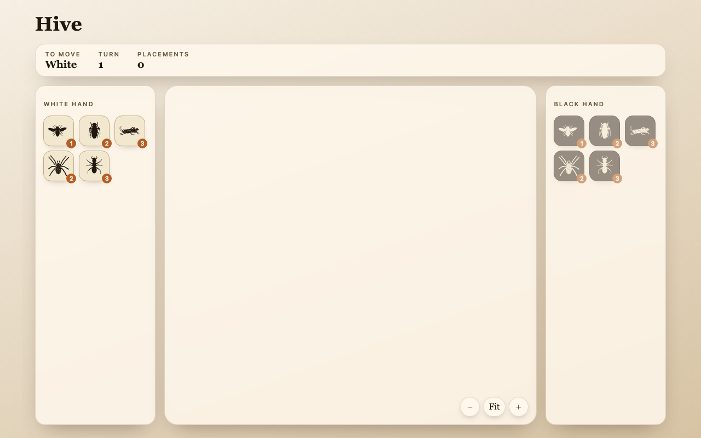

# Hivemind

A Rust implementation of the board game **Hive** (base game), built as a Cargo workspace with a high-performance engine and a playable web UI.

```
Hivemind-rust/
  engine/    # game rules, move generation, alpha-beta search
  ui/        # Leptos/WASM browser frontend (in progress)
```

## Engine

The engine (`hive-engine`) implements the full base-game ruleset including the queen, beetles, grasshoppers, spiders, and ants. It uses a hybrid state representation — a fixed-size piece array as the source of truth with a flat `Board` lookup for fast access — and maintains incremental caches (perimeter, placement legality) updated via make-unmake rather than recomputed from scratch.

**Performance (depth-5 perft):** ~2.26M nodes/sec, ~3.4× the reference TypeScript implementation.

### Key modules

| Module | Purpose |
|---|---|
| `state` | `State` struct, `apply`/`unapply`, undo stack |
| `board` | Flat 64×64 coord-keyed cell array |
| `gen/` | Legal-move generation per piece type |
| `rules` | One-Hive, freedom-to-move, Tarjan articulation |
| `search` | Alpha-beta with transposition table; fixed-depth and time-bounded entry points |
| `eval` | `Eval` trait (static dispatch) and the position evaluation behind it |
| `perft` | Bulk node counting for correctness checks |
| `zobrist` | Incremental Zobrist hashing |

### Build & test

```bash
# Build everything
cargo build --release

# Run all tests
cargo test --release

# Engine only
cargo test --release -p hive-engine

# Perft benchmark (default depth 3; try 4 or 5 for throughput numbers)
cargo run --release --example perft_bench [depth]

# Alpha-beta benchmark
cargo run --release --example search_bench [depth] [tt_log2]

# Self-play gauntlet: play two evaluations against each other at equal time
cargo run --release --example gauntlet
```

Evaluation changes are judged by gauntlet win rate, not node counts — a change
can cut nodes and play worse. Hive has no captures, so material is constant and
essentially all playing strength lives in the evaluation. The gauntlet uses
randomised openings (two deterministic engines from the initial position play
the *same game* every time) and colour-swapped pairs, so a colour or opening
advantage cancels rather than reading as a strength difference. It is a manual
pre-merge gate, not a CI step: ~180 games takes about 11 minutes on 4 cores.

Debug builds run proptest with more invariants enabled; release builds are faster for benchmarking.

### Correctness guarantees

A proptest in `tests/proptest_invariants.rs` runs random legal games and asserts on every move:

- Board ↔ piece array coherence
- One-Hive (single 6-connected component)
- Make-unmake round-trip (bit-for-bit `State` equality)
- Incremental Zobrist matches from-scratch
- Incremental cache sets match from-scratch

### Coordinate system

Axial `(q, r)` with six neighbour deltas defined once in `src/coord.rs`.

### Feature flags

| Flag | Effect |
|---|---|
| `serde` | Adds `Serialize`/`Deserialize` on public leaf types (`Coord`, `Move`, `Color`, `PieceId`, `PieceType`, `PieceSlot`, `StackTop`, `Outcome`) for JSON serialization in the UI |

## UI

A browser-playable frontend built with Leptos (CSR, compiled to WASM).



### Prerequisites

- [Rust toolchain](https://rustup.rs/) with the `wasm32-unknown-unknown` target:
  ```bash
  rustup target add wasm32-unknown-unknown
  ```
- [Trunk](https://trunkrs.dev/) — the WASM bundler/dev server:
  ```bash
  cargo install trunk
  ```

### Run locally

```bash
cd ui
trunk serve          # dev server at http://localhost:8080 with live reload
```

### Production build

```bash
cd ui
trunk build --release   # output goes to ui/dist/
```

The `dist/` folder is self-contained and can be served from any static host.

## Development

- Branch per change; PRs via `gh pr create`; CI must be green before merge
- No direct pushes to `main`
- Branch prefixes: `perf/`, `feat/`, `fix/`, `refactor/`, `ci/`, `docs/` for engine; `ui/feat/`, `ui/fix/`, etc. for frontend

## License

TBD
